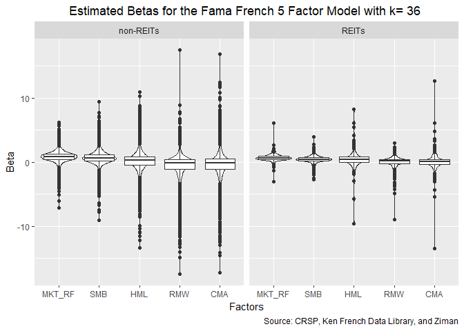
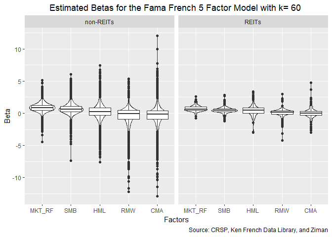
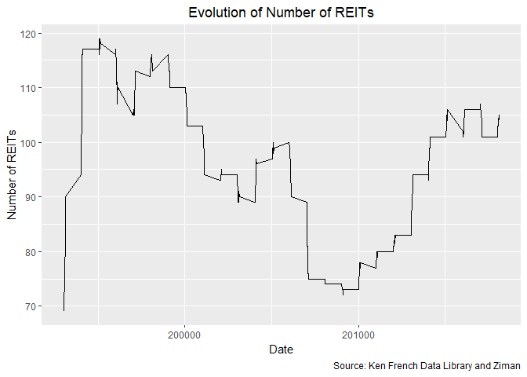

Betas
================
Jiaxi Li

Load Clean Data
===============

Load All.csv and select the applicable variables: log premiums, PERMNO, and isREIT

Beta Calculations with at least 3 years data
============================================

First, I would only choose the ones with more than 3 years worth of data (at least 36 data points) and also calculate the average risk premium for them.

    ## # A tibble: 2 x 2
    ##   isREIT    days_stocks
    ##   <fct>           <int>
    ## 1 non-REITs     1496878
    ## 2 REITs           29022

    ## # A tibble: 2 x 2
    ##   isREIT    stocks
    ##   <fct>      <int>
    ## 1 non-REITs  11503
    ## 2 REITs        208

There are 1,496,878 usable non-REITs day&returns and 29,022 usable REITs day&returns. They are from 11,503 non-REITs stocks and 208 REITs stocks.

I will apply all the available data for each asset to calculate the asset beta here. The model used is Fama French 5 Factor model.

According to <https://nelsonareal.net/blog/2017/06/speeding_up_ols.html>, I will use speedlm to do the regression since it is the fastest with formula. It is from the "speedglm" package. Since group\_by took too long to run, I have a for loop instead.

Save all the beta result in the csv file.

Since the second step should be a multi-linear regression, graph each beta against return may not result in a straight line. Instead, the distribution is presented here: 

With the distribution plot presented above, I also include the quartiles in the table below.
<table>
<caption>
Statistics of Betas of the Fama French 5 Factor Model with k= 36
</caption>
<thead>
<tr>
<th style="text-align:left;">
isREIT
</th>
<th style="text-align:left;">
stat
</th>
<th style="text-align:right;">
MKT\_RF
</th>
<th style="text-align:right;">
SMB
</th>
<th style="text-align:right;">
HML
</th>
<th style="text-align:right;">
RMW
</th>
<th style="text-align:right;">
CMA
</th>
</tr>
</thead>
<tbody>
<tr>
<td style="text-align:left;">
non-REITs
</td>
<td style="text-align:left;">
mean
</td>
<td style="text-align:right;">
0.8386673
</td>
<td style="text-align:right;">
0.6759036
</td>
<td style="text-align:right;">
0.1842398
</td>
<td style="text-align:right;">
-0.4829461
</td>
<td style="text-align:right;">
-0.3620639
</td>
</tr>
<tr>
<td style="text-align:left;">
non-REITs
</td>
<td style="text-align:left;">
variance
</td>
<td style="text-align:right;">
0.6851821
</td>
<td style="text-align:right;">
0.9511947
</td>
<td style="text-align:right;">
2.0498424
</td>
<td style="text-align:right;">
3.0442305
</td>
<td style="text-align:right;">
3.6426539
</td>
</tr>
<tr>
<td style="text-align:left;">
non-REITs
</td>
<td style="text-align:left;">
kurtosis
</td>
<td style="text-align:right;">
8.6127746
</td>
<td style="text-align:right;">
9.9975140
</td>
<td style="text-align:right;">
9.8336231
</td>
<td style="text-align:right;">
11.7203287
</td>
<td style="text-align:right;">
10.1663199
</td>
</tr>
<tr>
<td style="text-align:left;">
non-REITs
</td>
<td style="text-align:left;">
min
</td>
<td style="text-align:right;">
-7.0832566
</td>
<td style="text-align:right;">
-9.0232718
</td>
<td style="text-align:right;">
-13.3774089
</td>
<td style="text-align:right;">
-17.5001351
</td>
<td style="text-align:right;">
-17.1915887
</td>
</tr>
<tr>
<td style="text-align:left;">
non-REITs
</td>
<td style="text-align:left;">
Q1
</td>
<td style="text-align:right;">
0.4436772
</td>
<td style="text-align:right;">
0.1888081
</td>
<td style="text-align:right;">
-0.4312914
</td>
<td style="text-align:right;">
-1.0656846
</td>
<td style="text-align:right;">
-1.0535155
</td>
</tr>
<tr>
<td style="text-align:left;">
non-REITs
</td>
<td style="text-align:left;">
median
</td>
<td style="text-align:right;">
0.8599955
</td>
<td style="text-align:right;">
0.6364872
</td>
<td style="text-align:right;">
0.2455668
</td>
<td style="text-align:right;">
-0.1150317
</td>
<td style="text-align:right;">
-0.1540802
</td>
</tr>
<tr>
<td style="text-align:left;">
non-REITs
</td>
<td style="text-align:left;">
Q3
</td>
<td style="text-align:right;">
1.2778641
</td>
<td style="text-align:right;">
1.1347205
</td>
<td style="text-align:right;">
0.8724748
</td>
<td style="text-align:right;">
0.4517848
</td>
<td style="text-align:right;">
0.4930882
</td>
</tr>
<tr>
<td style="text-align:left;">
non-REITs
</td>
<td style="text-align:left;">
max
</td>
<td style="text-align:right;">
6.2270261
</td>
<td style="text-align:right;">
9.3980436
</td>
<td style="text-align:right;">
10.9731061
</td>
<td style="text-align:right;">
17.5027177
</td>
<td style="text-align:right;">
16.8297473
</td>
</tr>
<tr>
<td style="text-align:left;">
REITs
</td>
<td style="text-align:left;">
mean
</td>
<td style="text-align:right;">
0.6945588
</td>
<td style="text-align:right;">
0.4404870
</td>
<td style="text-align:right;">
0.4177376
</td>
<td style="text-align:right;">
-0.0196904
</td>
<td style="text-align:right;">
0.0709373
</td>
</tr>
<tr>
<td style="text-align:left;">
REITs
</td>
<td style="text-align:left;">
variance
</td>
<td style="text-align:right;">
0.3384023
</td>
<td style="text-align:right;">
0.4428709
</td>
<td style="text-align:right;">
1.3957237
</td>
<td style="text-align:right;">
0.9555790
</td>
<td style="text-align:right;">
2.0636996
</td>
</tr>
<tr>
<td style="text-align:left;">
REITs
</td>
<td style="text-align:left;">
kurtosis
</td>
<td style="text-align:right;">
27.6917371
</td>
<td style="text-align:right;">
10.6327236
</td>
<td style="text-align:right;">
25.3389993
</td>
<td style="text-align:right;">
25.2599187
</td>
<td style="text-align:right;">
41.6692789
</td>
</tr>
<tr>
<td style="text-align:left;">
REITs
</td>
<td style="text-align:left;">
min
</td>
<td style="text-align:right;">
-3.0838785
</td>
<td style="text-align:right;">
-2.6823888
</td>
<td style="text-align:right;">
-9.5565873
</td>
<td style="text-align:right;">
-8.9353153
</td>
<td style="text-align:right;">
-13.5134855
</td>
</tr>
<tr>
<td style="text-align:left;">
REITs
</td>
<td style="text-align:left;">
Q1
</td>
<td style="text-align:right;">
0.4241341
</td>
<td style="text-align:right;">
0.2364362
</td>
<td style="text-align:right;">
-0.0420512
</td>
<td style="text-align:right;">
-0.2030286
</td>
<td style="text-align:right;">
-0.3048564
</td>
</tr>
<tr>
<td style="text-align:left;">
REITs
</td>
<td style="text-align:left;">
median
</td>
<td style="text-align:right;">
0.6352517
</td>
<td style="text-align:right;">
0.4528053
</td>
<td style="text-align:right;">
0.4030601
</td>
<td style="text-align:right;">
0.1475565
</td>
<td style="text-align:right;">
0.0608416
</td>
</tr>
<tr>
<td style="text-align:left;">
REITs
</td>
<td style="text-align:left;">
Q3
</td>
<td style="text-align:right;">
0.9017813
</td>
<td style="text-align:right;">
0.7085501
</td>
<td style="text-align:right;">
0.8331367
</td>
<td style="text-align:right;">
0.3893753
</td>
<td style="text-align:right;">
0.4374014
</td>
</tr>
<tr>
<td style="text-align:left;">
REITs
</td>
<td style="text-align:left;">
max
</td>
<td style="text-align:right;">
6.0674250
</td>
<td style="text-align:right;">
3.9599783
</td>
<td style="text-align:right;">
8.2207905
</td>
<td style="text-align:right;">
2.9941258
</td>
<td style="text-align:right;">
12.6732841
</td>
</tr>
</tbody>
</table>
It seems that the distribution for REITs betas and non-REITs betas are similar.

Beta Calculations with at least 4 years data
============================================

Second, I would only choose the ones with more than 4 years worth of data (at least 48 data points) and also analysis the same way as before.

    ## # A tibble: 2 x 2
    ##   isREIT    days_stocks
    ##   <fct>           <int>
    ## 1 non-REITs     1438238
    ## 2 REITs           28000

    ## # A tibble: 2 x 2
    ##   isREIT    stocks
    ##   <fct>      <int>
    ## 1 non-REITs  10085
    ## 2 REITs        183

There are 1,438,238 usable non-REITs day&returns and 28,000 usable REITs day&returns. They are from 10,085 non-REITs stocks and 183 REITs stocks.

I will apply all the available data for each asset to calculate the asset beta here. The model used is Fama French 5 Factor model.

Save all the beta result in the csv file.

The distribution, again, is presented here: 

With the distribution plot presented above, I also include the quartiles in the table below.
<table>
<caption>
Statistics of Betas of the Fama French 5 Factor Model with k= 48
</caption>
<thead>
<tr>
<th style="text-align:left;">
isREIT
</th>
<th style="text-align:left;">
stat
</th>
<th style="text-align:right;">
MKT\_RF
</th>
<th style="text-align:right;">
SMB
</th>
<th style="text-align:right;">
HML
</th>
<th style="text-align:right;">
RMW
</th>
<th style="text-align:right;">
CMA
</th>
</tr>
</thead>
<tbody>
<tr>
<td style="text-align:left;">
non-REITs
</td>
<td style="text-align:left;">
mean
</td>
<td style="text-align:right;">
0.8597250
</td>
<td style="text-align:right;">
0.6751301
</td>
<td style="text-align:right;">
0.2007793
</td>
<td style="text-align:right;">
-0.4234306
</td>
<td style="text-align:right;">
-0.3297198
</td>
</tr>
<tr>
<td style="text-align:left;">
non-REITs
</td>
<td style="text-align:left;">
variance
</td>
<td style="text-align:right;">
0.5517871
</td>
<td style="text-align:right;">
0.7401771
</td>
<td style="text-align:right;">
1.6128563
</td>
<td style="text-align:right;">
2.2823429
</td>
<td style="text-align:right;">
2.7060482
</td>
</tr>
<tr>
<td style="text-align:left;">
non-REITs
</td>
<td style="text-align:left;">
kurtosis
</td>
<td style="text-align:right;">
7.1344532
</td>
<td style="text-align:right;">
8.9326959
</td>
<td style="text-align:right;">
9.2698180
</td>
<td style="text-align:right;">
10.3036857
</td>
<td style="text-align:right;">
9.4398981
</td>
</tr>
<tr>
<td style="text-align:left;">
non-REITs
</td>
<td style="text-align:left;">
min
</td>
<td style="text-align:right;">
-4.4980411
</td>
<td style="text-align:right;">
-7.7333487
</td>
<td style="text-align:right;">
-12.1731132
</td>
<td style="text-align:right;">
-13.9759008
</td>
<td style="text-align:right;">
-12.9472158
</td>
</tr>
<tr>
<td style="text-align:left;">
non-REITs
</td>
<td style="text-align:left;">
Q1
</td>
<td style="text-align:right;">
0.4705765
</td>
<td style="text-align:right;">
0.2120628
</td>
<td style="text-align:right;">
-0.3748385
</td>
<td style="text-align:right;">
-0.9900386
</td>
<td style="text-align:right;">
-0.9714769
</td>
</tr>
<tr>
<td style="text-align:left;">
non-REITs
</td>
<td style="text-align:left;">
median
</td>
<td style="text-align:right;">
0.8673439
</td>
<td style="text-align:right;">
0.6337720
</td>
<td style="text-align:right;">
0.2532618
</td>
<td style="text-align:right;">
-0.0923120
</td>
<td style="text-align:right;">
-0.1490887
</td>
</tr>
<tr>
<td style="text-align:left;">
non-REITs
</td>
<td style="text-align:left;">
Q3
</td>
<td style="text-align:right;">
1.2673076
</td>
<td style="text-align:right;">
1.0989422
</td>
<td style="text-align:right;">
0.8365141
</td>
<td style="text-align:right;">
0.4355346
</td>
<td style="text-align:right;">
0.4502398
</td>
</tr>
<tr>
<td style="text-align:left;">
non-REITs
</td>
<td style="text-align:left;">
max
</td>
<td style="text-align:right;">
5.6271794
</td>
<td style="text-align:right;">
7.2227018
</td>
<td style="text-align:right;">
8.8221192
</td>
<td style="text-align:right;">
8.9014200
</td>
<td style="text-align:right;">
12.4056693
</td>
</tr>
<tr>
<td style="text-align:left;">
REITs
</td>
<td style="text-align:left;">
mean
</td>
<td style="text-align:right;">
0.7354468
</td>
<td style="text-align:right;">
0.4432318
</td>
<td style="text-align:right;">
0.4079110
</td>
<td style="text-align:right;">
0.0327375
</td>
<td style="text-align:right;">
-0.0010093
</td>
</tr>
<tr>
<td style="text-align:left;">
REITs
</td>
<td style="text-align:left;">
variance
</td>
<td style="text-align:right;">
0.2934037
</td>
<td style="text-align:right;">
0.3649221
</td>
<td style="text-align:right;">
1.0273080
</td>
<td style="text-align:right;">
0.5914129
</td>
<td style="text-align:right;">
1.0448643
</td>
</tr>
<tr>
<td style="text-align:left;">
REITs
</td>
<td style="text-align:left;">
kurtosis
</td>
<td style="text-align:right;">
32.2992901
</td>
<td style="text-align:right;">
10.7331520
</td>
<td style="text-align:right;">
32.8922515
</td>
<td style="text-align:right;">
10.2624506
</td>
<td style="text-align:right;">
12.0518562
</td>
</tr>
<tr>
<td style="text-align:left;">
REITs
</td>
<td style="text-align:left;">
min
</td>
<td style="text-align:right;">
-0.7388517
</td>
<td style="text-align:right;">
-2.6823888
</td>
<td style="text-align:right;">
-9.5565873
</td>
<td style="text-align:right;">
-4.2194444
</td>
<td style="text-align:right;">
-5.3697447
</td>
</tr>
<tr>
<td style="text-align:left;">
REITs
</td>
<td style="text-align:left;">
Q1
</td>
<td style="text-align:right;">
0.4303445
</td>
<td style="text-align:right;">
0.2527938
</td>
<td style="text-align:right;">
0.0131519
</td>
<td style="text-align:right;">
-0.1477622
</td>
<td style="text-align:right;">
-0.3236539
</td>
</tr>
<tr>
<td style="text-align:left;">
REITs
</td>
<td style="text-align:left;">
median
</td>
<td style="text-align:right;">
0.6391559
</td>
<td style="text-align:right;">
0.4533398
</td>
<td style="text-align:right;">
0.4256736
</td>
<td style="text-align:right;">
0.1504100
</td>
<td style="text-align:right;">
0.0179922
</td>
</tr>
<tr>
<td style="text-align:left;">
REITs
</td>
<td style="text-align:left;">
Q3
</td>
<td style="text-align:right;">
0.9323611
</td>
<td style="text-align:right;">
0.7031768
</td>
<td style="text-align:right;">
0.8285455
</td>
<td style="text-align:right;">
0.3754743
</td>
<td style="text-align:right;">
0.3476219
</td>
</tr>
<tr>
<td style="text-align:left;">
REITs
</td>
<td style="text-align:left;">
max
</td>
<td style="text-align:right;">
6.0674250
</td>
<td style="text-align:right;">
2.8211602
</td>
<td style="text-align:right;">
4.2215940
</td>
<td style="text-align:right;">
2.9941258
</td>
<td style="text-align:right;">
6.1353766
</td>
</tr>
</tbody>
</table>
It seems that the distribution for REITs betas and non-REITs betas are similar.

Beta Calculations with at least 5 years data
============================================

Second, I would only choose the ones with more than 5 years worth of data (at least 60 data points) and also analysis the same way as before.

    ## # A tibble: 2 x 2
    ##   isREIT    days_stocks
    ##   <fct>           <int>
    ## 1 non-REITs     1364749
    ## 2 REITs           26423

    ## # A tibble: 2 x 2
    ##   isREIT    stocks
    ##   <fct>      <int>
    ## 1 non-REITs   8714
    ## 2 REITs        153

There are 1,364,749 usable non-REITs day&returns and 26,423 usable REITs day&returns. They are from 8,714 non-REITs stocks and 153 REITs stocks.

I will apply all the available data for each asset to calculate the asset beta here. The model used is Fama French 5 Factor model.

Save all the beta result in the csv file.

The distribution, again, is presented here: 

With the distribution plot presented above, I also include the quartiles in the table below.
<table>
<caption>
Statistics of Betas of the Fama French 5 Factor Model with k= 60
</caption>
<thead>
<tr>
<th style="text-align:left;">
isREIT
</th>
<th style="text-align:left;">
stat
</th>
<th style="text-align:right;">
MKT\_RF
</th>
<th style="text-align:right;">
SMB
</th>
<th style="text-align:right;">
HML
</th>
<th style="text-align:right;">
RMW
</th>
<th style="text-align:right;">
CMA
</th>
</tr>
</thead>
<tbody>
<tr>
<td style="text-align:left;">
non-REITs
</td>
<td style="text-align:left;">
mean
</td>
<td style="text-align:right;">
0.8791369
</td>
<td style="text-align:right;">
0.6771393
</td>
<td style="text-align:right;">
0.2337284
</td>
<td style="text-align:right;">
-0.3557741
</td>
<td style="text-align:right;">
-0.3127629
</td>
</tr>
<tr>
<td style="text-align:left;">
non-REITs
</td>
<td style="text-align:left;">
variance
</td>
<td style="text-align:right;">
0.4444765
</td>
<td style="text-align:right;">
0.5998925
</td>
<td style="text-align:right;">
1.3030996
</td>
<td style="text-align:right;">
1.7077935
</td>
<td style="text-align:right;">
2.1087089
</td>
</tr>
<tr>
<td style="text-align:left;">
non-REITs
</td>
<td style="text-align:left;">
kurtosis
</td>
<td style="text-align:right;">
6.1195640
</td>
<td style="text-align:right;">
8.1532274
</td>
<td style="text-align:right;">
6.8769478
</td>
<td style="text-align:right;">
8.9098882
</td>
<td style="text-align:right;">
9.2421725
</td>
</tr>
<tr>
<td style="text-align:left;">
non-REITs
</td>
<td style="text-align:left;">
min
</td>
<td style="text-align:right;">
-4.4980411
</td>
<td style="text-align:right;">
-7.4000386
</td>
<td style="text-align:right;">
-7.6101951
</td>
<td style="text-align:right;">
-12.2144259
</td>
<td style="text-align:right;">
-12.9472158
</td>
</tr>
<tr>
<td style="text-align:left;">
non-REITs
</td>
<td style="text-align:left;">
Q1
</td>
<td style="text-align:right;">
0.4963161
</td>
<td style="text-align:right;">
0.2299924
</td>
<td style="text-align:right;">
-0.3215177
</td>
<td style="text-align:right;">
-0.8992776
</td>
<td style="text-align:right;">
-0.9009769
</td>
</tr>
<tr>
<td style="text-align:left;">
non-REITs
</td>
<td style="text-align:left;">
median
</td>
<td style="text-align:right;">
0.8730602
</td>
<td style="text-align:right;">
0.6345751
</td>
<td style="text-align:right;">
0.2648859
</td>
<td style="text-align:right;">
-0.0683176
</td>
<td style="text-align:right;">
-0.1414030
</td>
</tr>
<tr>
<td style="text-align:left;">
non-REITs
</td>
<td style="text-align:left;">
Q3
</td>
<td style="text-align:right;">
1.2560835
</td>
<td style="text-align:right;">
1.0747983
</td>
<td style="text-align:right;">
0.8146172
</td>
<td style="text-align:right;">
0.4257860
</td>
<td style="text-align:right;">
0.4063358
</td>
</tr>
<tr>
<td style="text-align:left;">
non-REITs
</td>
<td style="text-align:left;">
max
</td>
<td style="text-align:right;">
5.1830564
</td>
<td style="text-align:right;">
6.0571921
</td>
<td style="text-align:right;">
7.4515856
</td>
<td style="text-align:right;">
5.3509120
</td>
<td style="text-align:right;">
12.0651063
</td>
</tr>
<tr>
<td style="text-align:left;">
REITs
</td>
<td style="text-align:left;">
mean
</td>
<td style="text-align:right;">
0.7473118
</td>
<td style="text-align:right;">
0.4778347
</td>
<td style="text-align:right;">
0.4386790
</td>
<td style="text-align:right;">
0.0312676
</td>
<td style="text-align:right;">
-0.0307974
</td>
</tr>
<tr>
<td style="text-align:left;">
REITs
</td>
<td style="text-align:left;">
variance
</td>
<td style="text-align:right;">
0.2120884
</td>
<td style="text-align:right;">
0.2501954
</td>
<td style="text-align:right;">
0.6501067
</td>
<td style="text-align:right;">
0.5261425
</td>
<td style="text-align:right;">
0.7300762
</td>
</tr>
<tr>
<td style="text-align:left;">
REITs
</td>
<td style="text-align:left;">
kurtosis
</td>
<td style="text-align:right;">
4.5826725
</td>
<td style="text-align:right;">
7.2117817
</td>
<td style="text-align:right;">
6.0142699
</td>
<td style="text-align:right;">
11.0509727
</td>
<td style="text-align:right;">
9.0540542
</td>
</tr>
<tr>
<td style="text-align:left;">
REITs
</td>
<td style="text-align:left;">
min
</td>
<td style="text-align:right;">
-0.7388517
</td>
<td style="text-align:right;">
-1.1975896
</td>
<td style="text-align:right;">
-2.9724983
</td>
<td style="text-align:right;">
-4.2194444
</td>
<td style="text-align:right;">
-3.0284402
</td>
</tr>
<tr>
<td style="text-align:left;">
REITs
</td>
<td style="text-align:left;">
Q1
</td>
<td style="text-align:right;">
0.4531434
</td>
<td style="text-align:right;">
0.2655661
</td>
<td style="text-align:right;">
0.0263451
</td>
<td style="text-align:right;">
-0.1432139
</td>
<td style="text-align:right;">
-0.3190681
</td>
</tr>
<tr>
<td style="text-align:left;">
REITs
</td>
<td style="text-align:left;">
median
</td>
<td style="text-align:right;">
0.6529277
</td>
<td style="text-align:right;">
0.4636275
</td>
<td style="text-align:right;">
0.4583613
</td>
<td style="text-align:right;">
0.1481568
</td>
<td style="text-align:right;">
-0.0099669
</td>
</tr>
<tr>
<td style="text-align:left;">
REITs
</td>
<td style="text-align:left;">
Q3
</td>
<td style="text-align:right;">
0.9633898
</td>
<td style="text-align:right;">
0.6997719
</td>
<td style="text-align:right;">
0.8323324
</td>
<td style="text-align:right;">
0.3623774
</td>
<td style="text-align:right;">
0.3277357
</td>
</tr>
<tr>
<td style="text-align:left;">
REITs
</td>
<td style="text-align:left;">
max
</td>
<td style="text-align:right;">
2.6446177
</td>
<td style="text-align:right;">
2.8211602
</td>
<td style="text-align:right;">
3.4086378
</td>
<td style="text-align:right;">
2.9941258
</td>
<td style="text-align:right;">
4.8001699
</td>
</tr>
</tbody>
</table>
It seems that the distribution for REITs betas and non-REITs betas are similar. With the Kurtosis estimation, it seems that the 5 year window REITs would have a more similar distribution as the non-REITs.

Number of REITs at each month
-----------------------------

It seems that there are 70 REITs. At most, there are 120 REITs.
