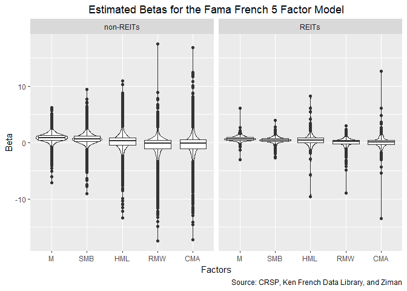

Betas
================
Jiaxi Li

Load Clean Data
===============

Load All.csv and select the applicable variables: log premiums, PERMNO, and isREIT

Beta Calculations
=================

First, I would only choose the ones with more than 3 years worth of data (at least 36 data points) and also calculate the average risk premium for them.

    ## # A tibble: 2 x 2
    ##   isREIT       n
    ##   <lgl>    <int>
    ## 1 FALSE  1496878
    ## 2 TRUE     49055

    ## # A tibble: 2 x 2
    ##   isREIT     n
    ##   <lgl>  <int>
    ## 1 FALSE  11503
    ## 2 TRUE     361

There are 1,496,878 usable non-REITs day&returns and 49,055 usable REITs day&returns. They are from 11,503 non-REITs stocks and 361 REITs stocks.

I will apply all the available data for each asset to calculate the asset beta here. The model used is Fama French 5 Factor model.

According to <https://nelsonareal.net/blog/2017/06/speeding_up_ols.html>, I will use speedlm to do the regression since it is the fastest with formula. It is from the "speedglm" package. Since group\_by took too long to run, I have a for loop instead.

Save all the beta result in the csv file.

Since the second step should be a multi-linear regression, graph each beta against return may not result in a straight line. Instead, the distribution is presented here. 

With the distribution plot presented above, I also include the quartiles in the table below.
<table>
<caption>
Statistics of Betas of the Fama French 5 Factor Model
</caption>
<thead>
<tr>
<th style="text-align:left;">
isREIT
</th>
<th style="text-align:left;">
stat
</th>
<th style="text-align:right;">
M
</th>
<th style="text-align:right;">
SMB
</th>
<th style="text-align:right;">
HML
</th>
<th style="text-align:right;">
RMW
</th>
<th style="text-align:right;">
CMA
</th>
</tr>
</thead>
<tbody>
<tr>
<td style="text-align:left;">
non-REITs
</td>
<td style="text-align:left;">
mean
</td>
<td style="text-align:right;">
0.8386673
</td>
<td style="text-align:right;">
0.6759036
</td>
<td style="text-align:right;">
0.1842398
</td>
<td style="text-align:right;">
-0.4829461
</td>
<td style="text-align:right;">
-0.3620639
</td>
</tr>
<tr>
<td style="text-align:left;">
non-REITs
</td>
<td style="text-align:left;">
variance
</td>
<td style="text-align:right;">
0.6851821
</td>
<td style="text-align:right;">
0.9511947
</td>
<td style="text-align:right;">
2.0498424
</td>
<td style="text-align:right;">
3.0442305
</td>
<td style="text-align:right;">
3.6426539
</td>
</tr>
<tr>
<td style="text-align:left;">
non-REITs
</td>
<td style="text-align:left;">
kurtosis
</td>
<td style="text-align:right;">
8.6127746
</td>
<td style="text-align:right;">
9.9975140
</td>
<td style="text-align:right;">
9.8336231
</td>
<td style="text-align:right;">
11.7203287
</td>
<td style="text-align:right;">
10.1663199
</td>
</tr>
<tr>
<td style="text-align:left;">
non-REITs
</td>
<td style="text-align:left;">
min
</td>
<td style="text-align:right;">
-7.0832566
</td>
<td style="text-align:right;">
-9.0232718
</td>
<td style="text-align:right;">
-13.3774089
</td>
<td style="text-align:right;">
-17.5001351
</td>
<td style="text-align:right;">
-17.1915887
</td>
</tr>
<tr>
<td style="text-align:left;">
non-REITs
</td>
<td style="text-align:left;">
Q1
</td>
<td style="text-align:right;">
0.4436772
</td>
<td style="text-align:right;">
0.1888081
</td>
<td style="text-align:right;">
-0.4312914
</td>
<td style="text-align:right;">
-1.0656846
</td>
<td style="text-align:right;">
-1.0535155
</td>
</tr>
<tr>
<td style="text-align:left;">
non-REITs
</td>
<td style="text-align:left;">
median
</td>
<td style="text-align:right;">
0.8599955
</td>
<td style="text-align:right;">
0.6364872
</td>
<td style="text-align:right;">
0.2455668
</td>
<td style="text-align:right;">
-0.1150317
</td>
<td style="text-align:right;">
-0.1540802
</td>
</tr>
<tr>
<td style="text-align:left;">
non-REITs
</td>
<td style="text-align:left;">
Q3
</td>
<td style="text-align:right;">
1.2778641
</td>
<td style="text-align:right;">
1.1347205
</td>
<td style="text-align:right;">
0.8724748
</td>
<td style="text-align:right;">
0.4517848
</td>
<td style="text-align:right;">
0.4930882
</td>
</tr>
<tr>
<td style="text-align:left;">
non-REITs
</td>
<td style="text-align:left;">
max
</td>
<td style="text-align:right;">
6.2270261
</td>
<td style="text-align:right;">
9.3980436
</td>
<td style="text-align:right;">
10.9731061
</td>
<td style="text-align:right;">
17.5027177
</td>
<td style="text-align:right;">
16.8297473
</td>
</tr>
<tr>
<td style="text-align:left;">
REITs
</td>
<td style="text-align:left;">
mean
</td>
<td style="text-align:right;">
0.6945588
</td>
<td style="text-align:right;">
0.4404870
</td>
<td style="text-align:right;">
0.4177376
</td>
<td style="text-align:right;">
-0.0196904
</td>
<td style="text-align:right;">
0.0709373
</td>
</tr>
<tr>
<td style="text-align:left;">
REITs
</td>
<td style="text-align:left;">
variance
</td>
<td style="text-align:right;">
0.3384023
</td>
<td style="text-align:right;">
0.4428709
</td>
<td style="text-align:right;">
1.3957237
</td>
<td style="text-align:right;">
0.9555790
</td>
<td style="text-align:right;">
2.0636996
</td>
</tr>
<tr>
<td style="text-align:left;">
REITs
</td>
<td style="text-align:left;">
kurtosis
</td>
<td style="text-align:right;">
27.6917371
</td>
<td style="text-align:right;">
10.6327236
</td>
<td style="text-align:right;">
25.3389993
</td>
<td style="text-align:right;">
25.2599187
</td>
<td style="text-align:right;">
41.6692789
</td>
</tr>
<tr>
<td style="text-align:left;">
REITs
</td>
<td style="text-align:left;">
min
</td>
<td style="text-align:right;">
-3.0838785
</td>
<td style="text-align:right;">
-2.6823888
</td>
<td style="text-align:right;">
-9.5565873
</td>
<td style="text-align:right;">
-8.9353153
</td>
<td style="text-align:right;">
-13.5134855
</td>
</tr>
<tr>
<td style="text-align:left;">
REITs
</td>
<td style="text-align:left;">
Q1
</td>
<td style="text-align:right;">
0.4241341
</td>
<td style="text-align:right;">
0.2364362
</td>
<td style="text-align:right;">
-0.0420512
</td>
<td style="text-align:right;">
-0.2030286
</td>
<td style="text-align:right;">
-0.3048564
</td>
</tr>
<tr>
<td style="text-align:left;">
REITs
</td>
<td style="text-align:left;">
median
</td>
<td style="text-align:right;">
0.6352517
</td>
<td style="text-align:right;">
0.4528053
</td>
<td style="text-align:right;">
0.4030601
</td>
<td style="text-align:right;">
0.1475565
</td>
<td style="text-align:right;">
0.0608416
</td>
</tr>
<tr>
<td style="text-align:left;">
REITs
</td>
<td style="text-align:left;">
Q3
</td>
<td style="text-align:right;">
0.9017813
</td>
<td style="text-align:right;">
0.7085501
</td>
<td style="text-align:right;">
0.8331367
</td>
<td style="text-align:right;">
0.3893753
</td>
<td style="text-align:right;">
0.4374014
</td>
</tr>
<tr>
<td style="text-align:left;">
REITs
</td>
<td style="text-align:left;">
max
</td>
<td style="text-align:right;">
6.0674250
</td>
<td style="text-align:right;">
3.9599783
</td>
<td style="text-align:right;">
8.2207905
</td>
<td style="text-align:right;">
2.9941258
</td>
<td style="text-align:right;">
12.6732841
</td>
</tr>
</tbody>
</table>
It seems that the distribution for REITs betas and non-REITs betas are similar.
