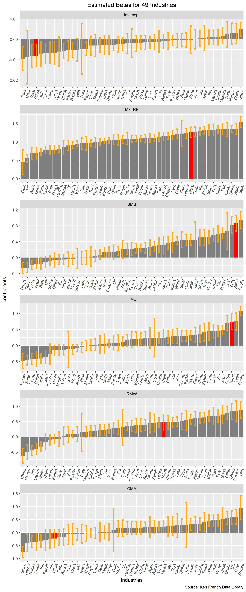
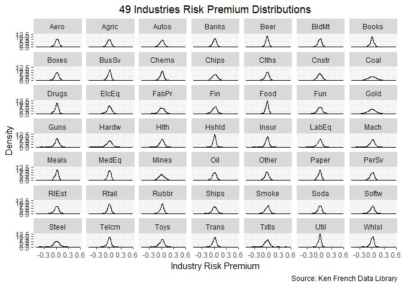
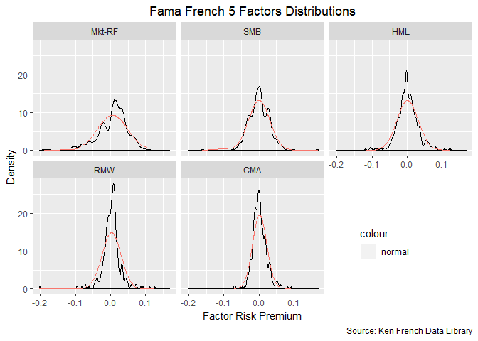
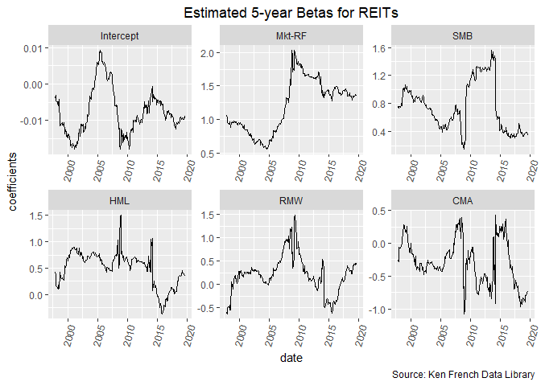

Sector
================
Jiaxi Li

In this file, I will analysis the sector level betas and compare the REITs ones against other sectors. The data here are from Ken French Data Library 49 industry portfolios since 1993.

Load Data
=========

Load FF5.csv and 49\_Industry\_Portfolios.csv

Merge Data, Clean Data, and Regression
======================================

I will merge the data and convert the simple return to log return. Since the graph does not work well, I made it, saved it and then loaded it.

Here, I would present the risk premiums distribution for each sector. 

Plot the time series plot for the betas
=======================================

Using 5 year windows for a time series beta plot 
